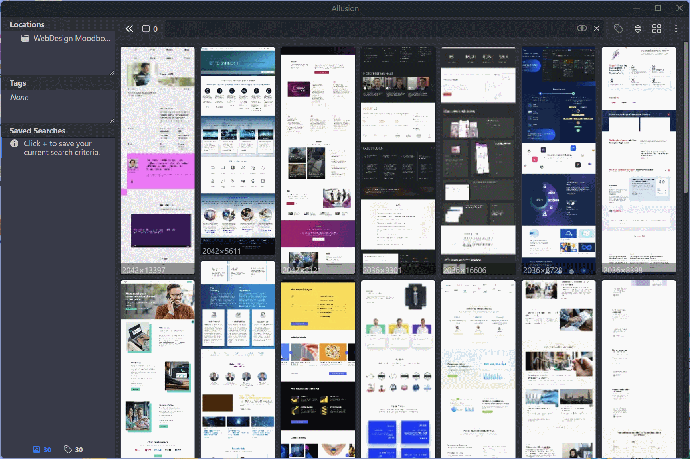
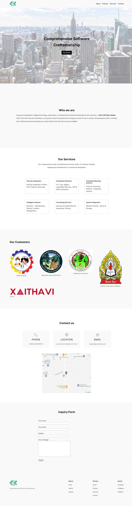
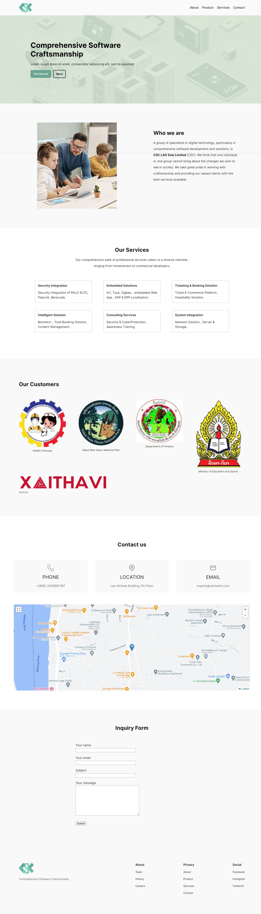
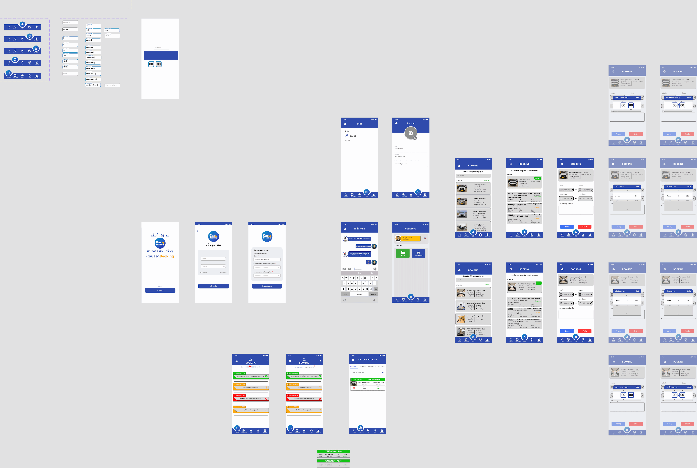

# CSC intern
To pursue and complete my education at Rangsit International College I am required take an intership at a place of my choice. I have been found CSC, a branch of UBSL and Mangkone.

## WordPress
To start off the intern, I have been told to make a website for the team using **WordPress.**

Ideally, a website is a reflection of the company or at least how it portrays to be. Being new to the team, I felt unable to find cues to feed my inspiration. Then I just decided to pick a minimalist template and start from there. There are a lot of methods and approach to design a website, and I certainly did not have the training.

With my previous experience as an art student, I knew that the coming into concrete starts from the abstract idea generation, which is why I used the software **Allusion** to gather all the IT website to be used for brainstorm.

 
preview of the software called Allusion  
 

Since I lacked experience, I never knew that sitemap-design, wireframe and design system were included in the steps of web design, thus they have been skipped.
Also, I found the work schedule to be incompatible with this creative process, theoretically speaking.

Taking inspiration from the sibling site https://ubslao.com/ and their PowerPoint slide, I put in place the necessary information and the initial prototype came into shape. I was being criticized of being too "centered" and leaving too much empty space; hence I spread the elements around and it became more generic.

(the left picture is a recreation of the old version because I did not document all my work)

Initial                   |     Final
:-------------------------:|:-------------------------:
  |  

During the process, I was "self-conflicting" between putting the actual information I had been given and putting the placeholder of the wireframe, but this marks again my lack of confidence which come from lack of experience.

It's important to note that WordPress comes both as SaaS and as Self-Hosted platform, which can be confusing, especially for people who just want to get started locally straight-away without needing to have a user management dashboard, since I was the only "user", but I guess there are features to satisfy enterprise's needs. To self-host without much hasle, I have used **Local by Flywheel** which has a user-friendly UI that allowed me to run an instance of WordPress easily.

WordPress has a set of conventional building blocks for making a website, in contrast to bare html writing and theses are: "Navigations, Styles, Pages, Templates, Patterns, Themes, Plugins" but in bare html, the html element tag themselves are the building blocks. While it can be great for some use cases, I felt creatively constrained by these conventions.

In conclusion, it was hard to conciliate being a web designer and web developer at the same time, and I dont think WordPress is for me.

## React Native

During the internship period, my supervisor told me he needed a mobile application (not for their clients but for the team), I then took it upon myself to learn and inquire into this field, as I felt behind my team in term of knowlegde. During this time, another group of interns did the design for the actual app in figma.

<figure>
    
    <figcaption> credit to Jo, Bie, Anna </figcaption>
</figure>

Because they were learners, no coherent design system can be guessed by the image, which would have helped any programmer in advance in  better organizing their Stylesheets. (store in the React's component ? or on a separate place to be shared as common).

Over time, we realise that we want to change the style, or a value, and changing it manually in multiple places is tiring. This is why it is important to store these values outside the scope the components, and not always "hardcode" them. It is not just the case for StyleSheets.

I as a learner, was inclined on choosing a UI framework to facilitate the task, but at the risk of not learning anything as it would abstract much of the functioning. Also this application seemed very specific, so the fear of not being able to write a peculiar component that the framework cannot provide was there. While we can always use third-party packages for the UI part, they do not always come with what we are looking for, or with unchangable defaults.

Despite this, I had choosen a beginner-friendly framework called **Expo**, which comes with very useful tools, such as **Expo Router.** It took me long to understand it because it was a new concept for me. It is a file-based routing system contrary to the traditional programmatically-based way.

<ins> What I have learned: </ins>
- 2 ways to develop in React Native: CLI or Expo
- Expo is a Web and Mobile framework.
- Expo directory structure is different that the CLI. (expo has `App` folder but CLI has `src`)
- **Expo Go** (their app) does not remedy not owning a phone of the opposite platform, we still need both an Android and iPhone  (what appear on one phone is not the same as the other platform)
- Ideally, for people without Mac, can use a VM, to develop in CLI. (hacky)
- Any file will be read first according to its alphabetical? order, that means `_layout.js` for example will be read before anything else.
- `_layout.*` can be used for pre-loading assets.
- "Nesting layout" is not "stacking".
- URLs parameters can be used to pass data to certain page, but sometimes using from cache is better.
- Mobile caching in 3 ways: Secure Storage, LocalAsyncStorage, SQLite.
- etc...

Features implementation can be long and sometimes, require a full rewrite, so it is important to decide beforehand, and not during the process. Alternatively we adopt a modular codebase structure to prepare for the future.

showcase of the app:  
the source code can be [found here on Github.](https://github.com/athklmrc/carbookingapp)

<video  height="500" controls>
  <source src="../vid/carmobileapp_showcase.mp4" type="video/mp4">
</video>

Unfortunatly, I could not finish it within the time of the internship, as I was learning and applying at the same time. It was my first ever mobile app I wrote, I found it fun and challenging and I still have a lot to learn.

The higher the level of abstraction the programming language is, the more opinionated it becomes, and the more specific is its use case.